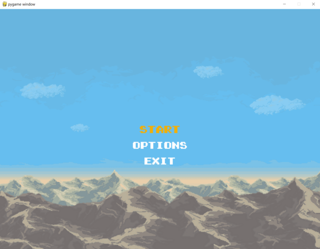
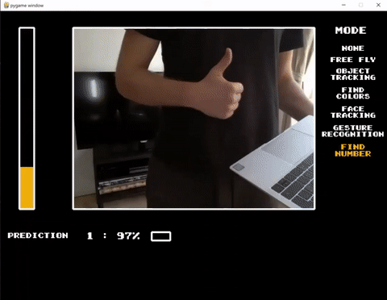
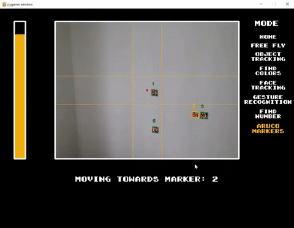

# Drone Challenge for DJI Tello Drone

This is a small UI based Python application for controlling DJI Tello Drone with additional modes to perform live face/object/gesture recognition and more.

# About

This project came about as an entry to the drone challenge (hence the name) created by a company I work for. The idea behind this challenge was to try out and learn more about Azure and AI technologies while having fun and building a Python app for DJI Tello drone.

Documentation below should help you get started and it also contains some notes on why or how some decisions were made.

## Disclaimer

This was my first atempt in building a Python app that's bigger than 100 lines.

There's also plenty left to fix and improve. Any contribution is very welcome and highly appreciated.

I made this project public with hopes that it will help someone to get started with drone programming or give inspiration for some cool new ideas.

# Getting Started

You can start the app by running `src\main.py` file.
## Prerequisites

- [**DJI Tello drone**](https://store.dji.com/dk/shop/tello-series)

- **Python 3.8**

- **Virtual Environment (venv)** - it's an isolated installation of Python and its libraries. You can live without it but it's highly recommended to use one since you would be avoiding package version conflicts and much more. (I did not use one when I started working on this and later regretted it)

- **Python packages** - run `pip install -r requirementsFull.txt` to install all required dependencies

- **Azure Subscription** - if you want to build a new face recognition model

- [**lobe.ai**](https://www.lobe.ai/) - App for building gesture recognition models. If you plan to build a new one.

## Requirements File

There are 3 requirement files in this solution. Ideally they should be cleaned up and refactored, but for now here's what it is:

- requirements.txt - minimum required modules, excluding Tensorflow and related AI modules
- requirementsFull.txt - **main** file with all required dependencies
- requirements-linux.txt - modules (and versions) for building solution on linux (not stable)

# App

UI and game-like look came from an idea to run this app on [Picade](https://shop.pimoroni.com/products/picade?variant=29210087489619). This also helped to add structure to different drone flight modes and to manage app settings.

I was testing on 10" Picade so current screen size is set to: 1024x768 (4:3 ratio)

Main Python modules:

- **Pygame** - for creating UI
- **djitellopy2** - for controlling Tello drone
- **opencv-python** - for all kinds of image manipulation
- **tensorflow** - for working with AI models

## Controls

Intent was to be able to contol drone using custom controller (in my case - Picade). This is why the app has 2 control modes - `keyboard` and `picade`

All controls and key bindings are defined in:
`src\helpers\controlsHelper.py`

## Settings

Full app settings can be found in: `src\settings.config`
Startup settings are implemented using python module: `ConfigObject`

### In-app options

In-app options use config file as well. Values are loaded and on save written to `settings.config`.

`Color Calibration` sets color values used in drone `Object Tracking` mode.

`Debug Mode` - If enabled, skips connecting to drone and uses integrated cammera instead. All drone movement commands are skipped as well.

`Volume` and `Controls` - NOT implemented

# Flight Modes

Flight modes started out as different 'challenges' to complete. Challenges varied in difficulty, starting out with 'control drone using keyboard' or 'use cv2 to track object on screen' and more difficult ones like 'recognise hand gesture (number) and find it in a room around you'.

Only one mode can be active at a time.

### None

Drone is not flying, only camera feed is displayed

### Free Fly

Drone is flying and can be controlled using selected input method.

Disabled in `Debug` mode

### Object Tracking

Searches for configured color and if detected - centers drone to face detected object.

Color detection is done using OpenCV (cv2) [module](https://pypi.org/project/opencv-python/)

In `Debug` mode drone movements are skipped.

### Find Colors

Drone rotates around and tries to find configured colors one at a time. If color is detected - drone adjusts its position to have object centered. After color is centered and confirmed - action moves to next color.

Color detection is done using OpenCV (cv2) [module](https://pypi.org/project/opencv-python/)

### Face Tracking

Face detection is performed and if face is detected - drone moves to keep the face centered.

Face Tracking and some other modes require quite some time to initiate/load. There is a setting `initmodesonstart` which, if enabled, initiates all required modules on app load instead of on mode start.

For face tracking - a model was created using Microsoft Cognitive Services [Custom Vision](https://azure.microsoft.com/en-us/services/cognitive-services/custom-vision-service/#overview)

Official page: [customvision.ai](https://www.customvision.ai/) (Requires Azure Subscription, free trial available)

Model is exported in protobuf (.pb) format and loaded using TensorFlow. Custom Vision service has various [export formats](https://docs.microsoft.com/en-us/azure/cognitive-services/custom-vision-service/export-your-model#export-options) and example scripts for getting started.

### Gesture Recognition

Uses a custom built model to detect hand gesture and displays detected value on screen. Since this is just a PoC and recognition quality varies depending on conditions - 5 subsequent detections should match before detection is confirmed.

[lobe.ai](https://www.lobe.ai/) was used to create and export model used for gesture recognition. It was exported in protobuf (.pb) format and loaded using TensorFlow.

Model was created using ~800 images for different hand gestures. It was not optimized for consistency, so diffent backgrounds, angles, positions can result in incorrect results.

### Find Number

Combines `Gesture Recognition` mode and OCR on detected objects. After gesture (number 0-5) is detected - drone starts rotating around and searching for detected number. If number is found - drone adjusts its position to center on it. once number is centered and confirmed - drone moves back to original position and waits for next gesture input.

Gesture Recognition is performed using custom model as described above. Number detectioin is performed by looking for rectangular bounding boxes and if found - performing OCR on content inside. OCR is done using python module [pytesseract](https://pypi.org/project/pytesseract/)

### Aruco Markers

Searches for predefined Aruco markers and centers drone on them. Markers have values 1 to 6 and drone loops and tries to find them repeatedly.

Markers can be easily [generated](https://chev.me/arucogen/) and detected using [openCV module](https://docs.opencv.org/4.x/d5/dae/tutorial_aruco_detection.html).

# Automation

`NOT USED`

`pipelines\appBuild.yml` is an Azure DevOps pipeline (from before this solution was moved to Github). Its purpose was to build solution into an executable file for Windows and Linux. That's why there are multiple requirement.txt files in this solution

In the end, I dropped it since there were module incompatibilities which took too much time to resolve.

# Picade

Flying a drone from Picade was my end goal for this project.

[Picade](https://learn.pimoroni.com/article/assembling-your-picade) is a build-it-yourself retro gaming console built on Raspberry PI. In my case it runs a [RetroPie](https://retropie.org.uk/) image on top of Ubuntu OS, which means I can exit RetroPie and use full power of Ubuntu console.

To run this solution on Picade, I found it easiest to to create a virtual environment, clone this repository, install all required python packages and run the app from console.

NOTE: I was not able to install tensorflow (and maybe some other) modules on ubuntu, so I ended up creating a new `requirements.txt` file containing only core modules. It took some refactoring (including introducing `useTensorflow` setting) and in the end there was now an option to build solution excluding custom AI features (face tracking, gestrure recognition).

You need a keyboard to configure this solution on Picade but once done, only built in controller is enough to run it (assuming all cmd commands are in memory).

## Picade Key Configuration

Depending on your Picade input configuration, your keys might not match my setup. My configuration can be found in `src\helpers\controlsHelper.py` file.

To find what key IDs your Picade has - you can run a small pygame script that outputs something like:
`print(pygame.key.name(event.key))`

## How to Configure DroneChallenge on Raspberry

My recollection of how I did this step is pretty bad, but general steps are:

- Make sure Python 3.8 is installed
- clone repository to your Raspberry
- create a virtual environment (venv)
- in venv - install dependencies from Requirements.txt file
- run: Python3 main.py

## How to run DroneChallenge from Picade

From Picade main menu:

 1. Go to: RetroPie
 2. Connect to Wifi (It helps a lot if your drone Wifi does not have password)
 3. Click: Front Left Black Button (Main Menu)
 4. Go to: Quit -> Quit EmulationStation -> Yes

In Console (move up/down to select commands from history):
Right side black button - confirm (enter)
From Root:

 1. Cd Desktop/drone/DroneChallenge
 2. Source ../venv/bin/activate (To go out of venv, run command: deactivate)

# Lessons Learned

**Do things right from step one** - the amount of times I refactored this solution is way too high! only because I thought that 'I just need to paste a few code snippets in to make it run and that's it'. The solution grew rapidly, I realised I need virtual environment, requirements file etc. I would've been much easier to inverst time in the begining, plan it out and only then start building.

**Document everything!** - It's now been over half a year since I last made a change and it's painful to admit how much I forgot already. Especially around configuring environments, builds, package versions.

**AI services are available to averyone and it's easy to get started** - it takes less than half hour to train your first model, it's free and there's plenty of different services available.
